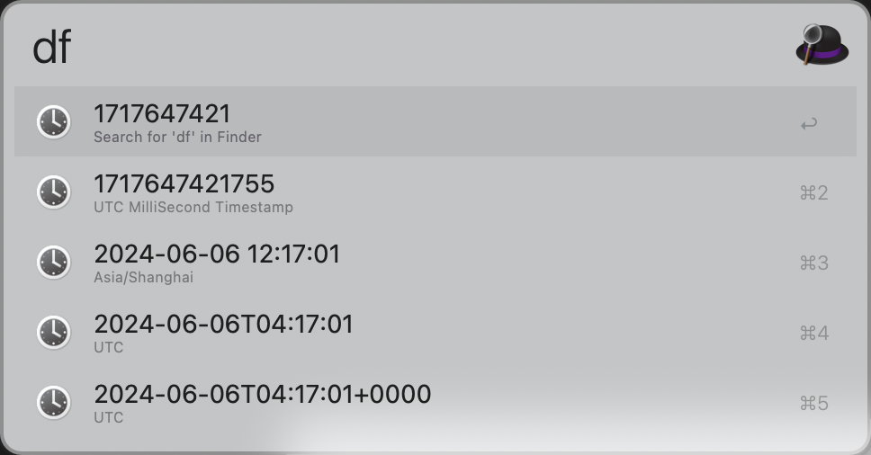
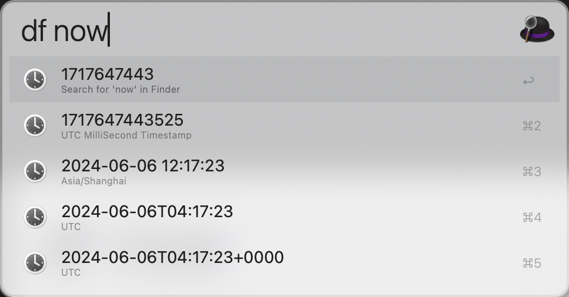
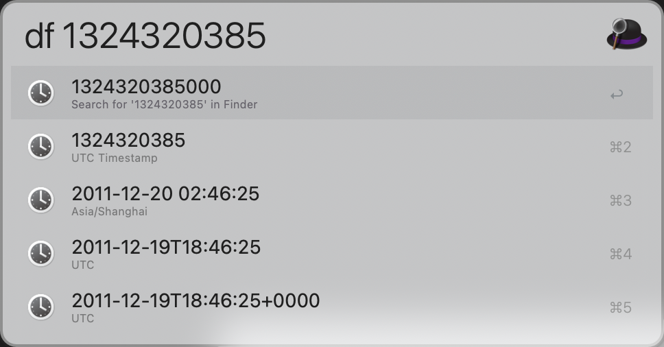
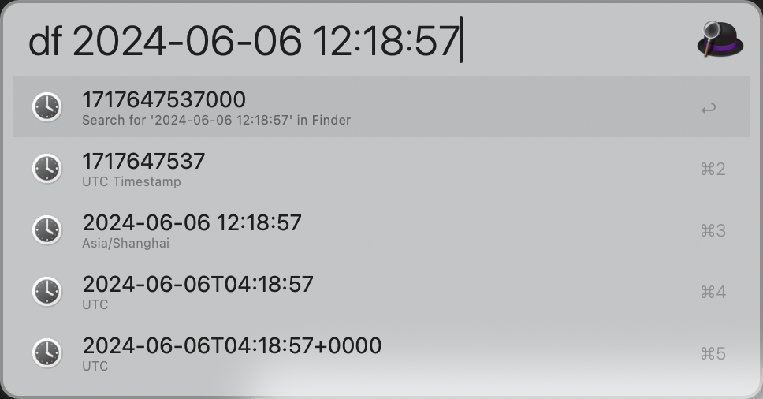
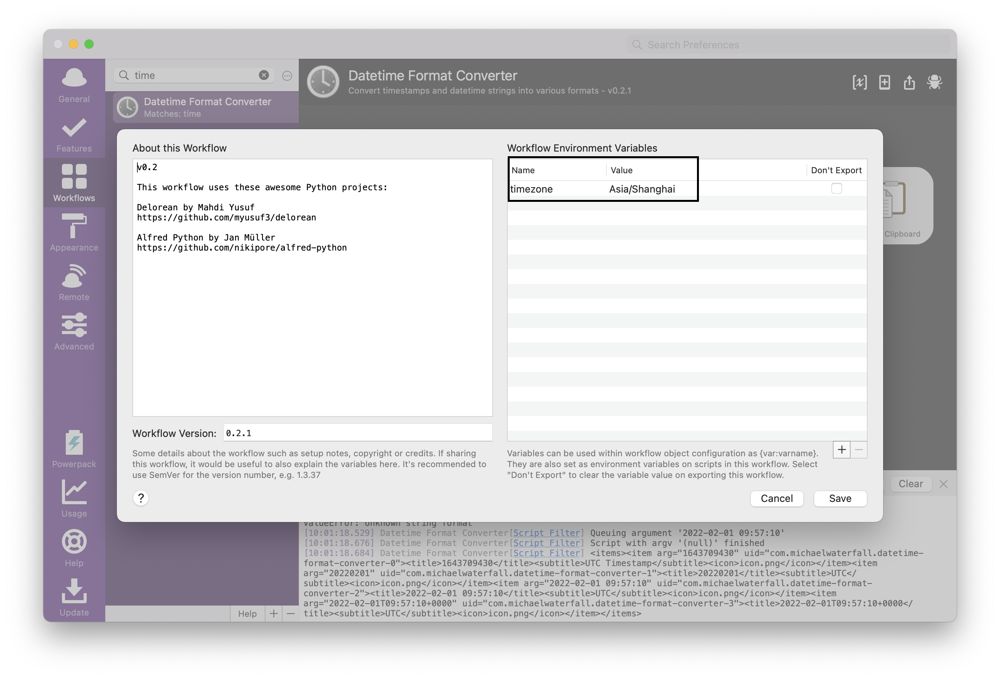

alfred-datetime-format-converter (Python 3 compatible version)
================================
## Improve
You can directly input keywords to display the current time information. The issue of copying millisecond-level timestamps and the problem of dates not being convertible to timestamps have been fixed.

## Introduction

Alfred workflow for converting between timestamps and formatted datetime strings with ease.

Simply type "df" followed by: "now", a UTC unix timestamp, or a formatted datetime string.

This will present you with the parsed date in various formats ready to copy to your clipboard.
[Download](https://raw.github.com/myceciliababy/alfred-datetime-format-converter/blob/main/download/DatetimeFormatConverter.alfredworkflow)

You can define your timezone variable in Alfred workflow variables (Name "timezone", Value following pytz convertions like "US/Eastern") to control displaying datetime. If variable missing, UTC is used by default.

Licenses
--------

Copyright (c) 2013 Michael Waterfall, published under the MIT License

Includes packages:
* [pytz](https://pythonhosted.org/pytz/) published under the MIT License
* [tzlocal](https://github.com/regebro/tzlocal) published under the MIT License
* [alfred-python](https://github.com/nikipore/alfred-python) published under the Apache 2.0 License
* [delorean](https://github.com/myusuf3/delorean) published under the MIT License

